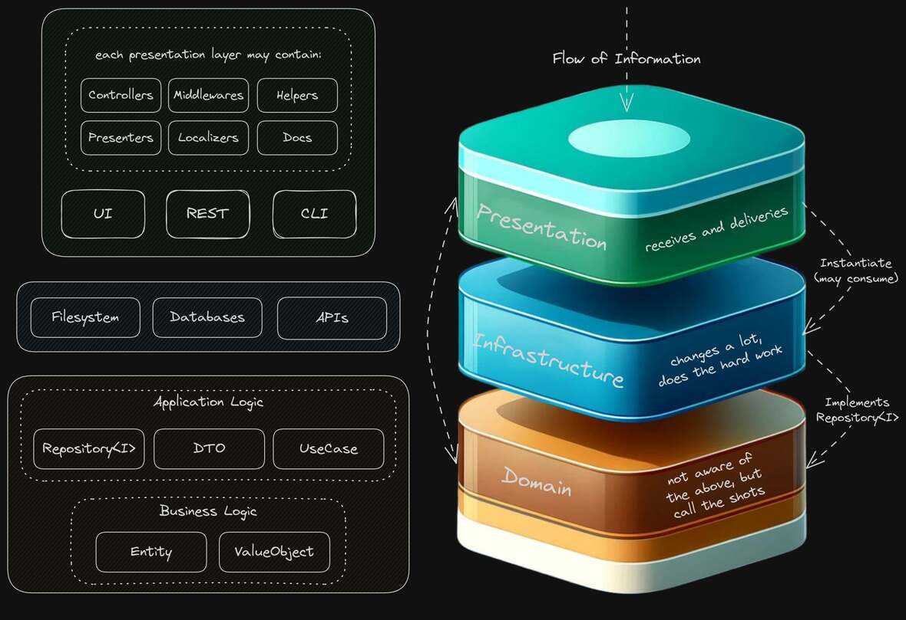

# Full Stack Go with Clean Architecture and DDD: A Proof of Concept

## Introduction

> The center of your application is not the database. Nor is it one or more of the frameworks you may be using. **The center of your application is the use cases of your application** - _Unclebob_ ([source](https://blog.8thlight.com/uncle-bob/2012/05/15/NODB.html "NODB"))

This project builds upon the principles demonstrated in the [PHP version](https://github.com/ntorga/clean-ddd-php-poc-contacts) of our Clean Architecture and Domain-Driven Design (DDD) Proof of Concept (PoC). Before diving into this Go implementation, we recommend familiarizing yourself with the PHP version to grasp the foundational concepts that drive this project.



## Disclaimer

This project is **NOT** intended for a production environment. It is a **proof of concept** (PoC) that does not meet traditional requirements in terms of availability nor scalability.

**Not all concepts mentioned here were followed to the letter**. The idea is to comply with the [SOLID principles](https://scotch.io/bar-talk/s-o-l-i-d-the-first-five-principles-of-object-oriented-design) as much as possible, with a few exceptions to simplify the code.

## Objective

The primary aim with this Go-based PoC is to demonstrate how Clean Architecture and DDD principles can be effectively implemented in a full stack Go project. However, you'll also find a few additional features that were not present in the PHP version:

- **Database**: Data needs to be in an actual database. SQLite was chosen for its simplicity;
- **CLI**: A command-line interface (CLI) to interact with the application;
- **Front-end**: A server side rendered (SSR) HTML application with reactivity, but without a framework such as Next.js (React) or Nuxt.js (Vue);
- **Hot Reload**: The browser will reload automatically when changes are made to the application thanks to `air`, `xdotool` and `tmux`.

## Technologies

- Go
- Echo
- Cobra
- GORM
- SQLite
- Templ
- Unpoly
- TailwindCSS (via Flowbite)

## Deploy

The binary file is available for Linux amd64. You can download it from the [releases page](https://github.com/ntorga/clean-ddd-full-stack-go-poc/releases).

To run the application, you just need to execute the binary file. The application will be available at `http://localhost:8080`.

```bash
chmod +x clean-ddd-full-stack-go-poc
./clean-ddd-full-stack-go-poc
```

## Development

1. Install `xdotool` and `tmux`. For Ubuntu, you can install them with `sudo apt install xdotool tmux`.

2. Install the `tailwindcss` [standalone CLI](https://tailwindcss.com/blog/standalone-cli), `air` and `templ`:

```bash
go install github.com/cosmtrek/air@latest
go install github.com/a-h/templ/cmd/templ@latest
```

The `tailwind.config.js` file is not read by the `tailwindcss` CLI. Just like the CLI itself, the config file is present just to make the VSCode Tailwind CSS extension work. The Tailwind is deployed in this application using the Flowbite jsDelivr CDN and does not need to run the watcher or build the CSS every time you make a change.

3. Install the following VSCode extensions:

```
golang.go
streetsidesoftware.code-spell-checker
esbenp.prettier-vscode
bradlc.vscode-tailwindcss
Trapfether.tailwind-raw-reorder
a-h.templ
hbenl.vscode-test-explorer
yy0931.vscode-sqlite3-editor
be5invis.toml
```

4. Run the following command to start the application:

```bash
make dev
```

## Q&A

**Why not use HTMX + Alpine.js?**

Although HTMX and Alpine.js are a great combo, I chose Unpoly because it's a bit more powerful. It has out-of-the-box support for compiler, layers, preloading, caching pages and it's easy to diff an entire HTML page.

By diffing the entire page, I can return a full HTML page and Unpoly will update only the parts that have changed based on CSS selectors. This way, I don't need to create duplicated endpoints for write operations that returns HTML fragments, I can consume the REST JSON API on updates and retrieve the full HTML page after the update.

**Why not Next.js (React), Astro or Nuxt.js (Vue)?**

My goal with this PoC is to keep my toolset as simple as possible. I wanted to see if I could achieve the same result without a framework. I wanted to see if I could build a server side rendered (SSR) HTML application with reactivity without a framework.

**Why not use TailwindCSS CLI to build the CSS?**

The Flowbite CSS file is 140kb in size. The CSS generated by the CLI would be 15kb. One hundred kilobytes does not justify the complexity of running the watcher to build the CSS every time you make a change and then commit to the repository. The Flowbite CSS is deployed using the jsDelivr CDN.

**Why not PostgreSQL, MySQL or MongoDB?**

No need for a heavy database for this PoC. SQLite is more than enough for this project. The focus is on the architecture, not the database. However, since we are using GORM, it would be easy to switch to another database if needed.

**Why not Python, Ruby, PHP or JavaScript/TypeScript?**

I think Go has a great developer experience, it's fast, has a great standard library and it's easy to deploy. With Go, the entire project is a single binary. No need for a runtime or a virtual environment. REST API, CLI and HTML with a single command.

## Documentation

The REST API documentation follows the [OpenAPI v2 specification](https://swagger.io/specification/).

### Generating the Documentation

To generate the documentation, you need to have composer and the dependencies installed. Then, run the following command:

```
swag init -g src/presentation/api/api.go -o src/presentation/api/docs
```

You must run this command every time you update the controllers or the domain.

### Viewing the Documentation

The `src/presentation/api/docs/swagger.json` file contains the documentation in the OpenAPI v2 specification.

To see the documentation, you can use any tool that supports this specification, such as the [Swagger Online Editor](https://editor.swagger.io/).

When using the Swagger Online Editor, you can import the `swagger.json` file by clicking on the `File` menu and then on `Import file`.

The swagger file is also available in the API itself. To see it, just access the `/api/swagger/` endpoint.

## Contacts

For any question or feedback feel free to contact me:

- Email: northontorga _(plus)_ github _(at)_ gmail.com
- LinkedIn: [Northon Torga](https://www.linkedin.com/in/ntorga/)
- Instagram [@ntorga](https://www.instagram.com/ntorga/)
- Twitter: [@NorthonTorga](https://twitter.com/northontorga)
