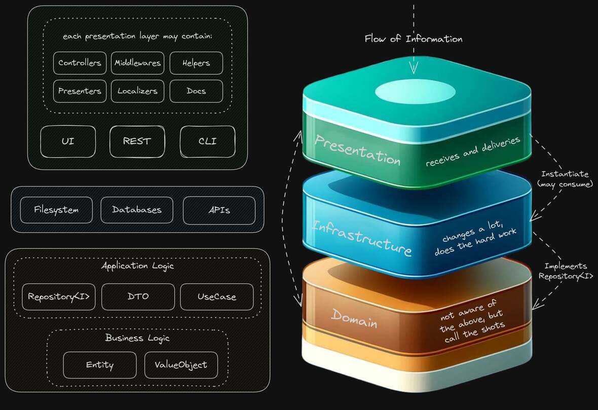

# Full Stack Go with Clean Architecture and DDD: A Proof of Concept

## Introduction

> The center of your application is not the database. Nor is it one or more of the frameworks you may be using. **The center of your application is the use cases of your application** - _Unclebob_ ([source](https://blog.8thlight.com/uncle-bob/2012/05/15/NODB.html "NODB"))

This project builds upon the principles demonstrated in the [PHP version](https://github.com/ntorga/clean-ddd-php-poc-contacts) of our Clean Architecture and Domain-Driven Design (DDD) Proof of Concept (PoC). Before diving into this Go implementation, we recommend familiarizing yourself with the PHP version to grasp the foundational concepts that drive this project.



## Disclaimer

This project is **NOT** intended for a production environment. It is a **proof of concept** (PoC) that does not meet traditional requirements in terms of availability nor scalability.

**Not all concepts mentioned here were followed to the letter**. The idea is to comply with the known design principles and patterns, but not to be dogmatic about them.

## Objective

The primary aim with this Go-based PoC is to demonstrate how Clean Architecture and DDD principles can be effectively implemented in a full stack Go project. However, you'll also find a few additional features that were not present in the PHP version:

- **Database**: Data needs to be in an actual database. SQLite was chosen for its simplicity;
- **CLI**: A command-line interface (CLI) to interact with the application;
- **Front-end**: A server side rendered (SSR) HTML application with reactivity, but without a framework such as Next.js (React) or Nuxt.js (Vue);
- **Hot Reload**: The browser will reload automatically when changes are made to the application thanks to `air`, `xdotool` and `tmux`.
- **No Exceptions/Panic**: The application does not use exceptions or panic. Instead, errors are dealt with gracefully;

## Technologies

- [Go](https://github.com/golang/go): the programming language;
- [Echo](https://github.com/labstack/echo): the HTTP framework used for the REST API;
- [Cobra](https://github.com/spf13/cobra): the CLI framework;
- [GORM](https://github.com/go-gorm/gorm): the ORM used to interact with the database;
- [SQLite](https://github.com/sqlite/sqlite): the database;
- [Templ](https://github.com/a-h/templ): the templating engine;
- [HTMX](https://github.com/bigskysoftware/htmx): the library used to add AJAX to the HTML;
- [Alpine.js](https://github.com/alpinejs/alpine): the library used to add reactivity to the HTML;
- [Tailwind CSS](https://github.com/tailwindlabs/tailwindcss) [(via UnoCSS)](https://github.com/unocss/unocss): the CSS framework;

## Deploy

The binary files are available for download on the [releases page](https://github.com/ntorga/clean-ddd-full-stack-go-poc/releases).

To run the application, you just need to execute the binary file. The application will be available at `http://localhost:8080`.

For instance on Linux:

```bash
chmod +x poc-linux-amd64
./poc-linux-amd64 serve
```

Although the binary files are available, only the linux/amd64 version is tested. If you face any issues with the compiled binaries, please report on the [issues page](https://github.com/ntorga/clean-ddd-full-stack-go-poc/issues).

## Development

1. Install `xdotool` and `tmux`. For Ubuntu, you can install them with `sudo apt install xdotool tmux`.

2. Install `air` and `templ`:

```bash
go install github.com/cosmtrek/air@latest
go install github.com/a-h/templ/cmd/templ@latest
```

The `tailwind.config.js` file is not used, it is present just to make the VSCode Tailwind CSS extension work. The Tailwind CSS is deployed in this application using UnoCSS (no CLI needed).

3. Install the following VSCode extensions:

```
golang.go
streetsidesoftware.code-spell-checker
esbenp.prettier-vscode
bradlc.vscode-tailwindcss
Trapfether.tailwind-raw-reorder
a-h.templ
hbenl.vscode-test-explorer
yy0931.vscode-sqlite3-editor
be5invis.toml
```

4. Run the following command to start the application:

```bash
make dev
```

The application will be available at `http://localhost:8080` and will hot reload your browser active tab if changes are made to `.templ` files on the last 60 seconds.

## Q&A

**Why not use React, Vue or Svelte?**

I wanted to decrease as much as possible the usage of JavaScript to reduce the complexity of the project. HTMX and Alpine.js adds the necessary DOM manipulation tools without the need for a opinionated framework and with very little JavaScript. In fact, the only JavaScript in the project is the state management (why isn't there an official standard for that yet?) and a event listener/dispatcher inside the HTML tags.

**Why not Next.js (React), Astro or Nuxt.js (Vue)?**

To fully understand why, I recommend reading the article "[What it’s like to run HTMX in Production - Stories from Experienced Software Engineers](https://hamy.xyz/labs/2024-04_htmx-in-production)" to understand the benefits of using HTMX and Alpine.js.

To put it simply, I didn't want the loop of DB -> Backend Logic -> JSON -> Frontend Logic -> HTML. I wanted to go from DB -> Backend Logic -> HTML and then add reactivity with HTMX and Alpine.js. That way I can reduce the tooling and the complexity of the project.

**Why not use Tailwind CSS CLI to build the CSS?**

I don't intent on using plugins or custom configurations for Tailwind CSS. I want just the basics and UnoCSS gives you Tailwind CSS without the need for a build process.

**Why not PostgreSQL, MySQL or MongoDB?**

SQLite is more than enough for a PoC. The focus is on the architecture, not the database. However, since we are using GORM, it would be easy to switch to another database if needed or you could try [Turso](https://turso.tech) with a few modifications to [GORM](https://github.com/go-gorm/sqlite/pull/185).

**Why not Rust, Python, Ruby, PHP or JavaScript/TypeScript?**

Go has a great standard library and it's easy to learn. The deployment is very simple, just a single binary. The performance is great and the language is very stable. No need for a runtime or a virtual environment. The entire project is a single binary. REST API, CLI and HTML with a single command.

However, why don't you try to implement this PoC in another language? It would be a great learning experience for sure. (:

## Documentation

The REST API documentation follows the [OpenAPI v2 specification](https://swagger.io/specification/).

### Generating the Documentation

To generate the documentation, you need to have composer and the dependencies installed. Then, run the following command:

```
swag init -g src/presentation/api/api.go -o src/presentation/api/docs
```

You must run this command every time you update the controllers or the domain.

### Viewing the Documentation

The `src/presentation/api/docs/swagger.json` file contains the documentation in the OpenAPI v2 specification.

To see the documentation, you can use any tool that supports this specification, such as the [Swagger Online Editor](https://editor.swagger.io/).

When using the Swagger Online Editor, you can import the `swagger.json` file by clicking on the `File` menu and then on `Import file`.

The swagger file is also available in the API itself. To see it, just access the `/api/swagger/` endpoint.

## Resources

- [Clean Architecture: A Craftsman's Guide to Software Structure and Design](https://www.amazon.com/Clean-Architecture-Craftsmans-Software-Structure/dp/0134494164): the book by Uncle Bob;
- [Intro to Clean Architecture & Domain Driven Design on PHP](https://ntorga.com/introduction-to-clean-architecture-and-domain-driven-design-on-php/): a series of articles that explains the concepts used in this project;
- [Refactoring Journey of the Clean Arch PHP PoC](https://www.youtube.com/playlist?list=PLhai202gRL3f0IUmzjd7XytNBghjOpeND): a playlist that shows the refactoring of the PHP PoC after 4 years of the original implementation;
- [Refactoring Guru](https://refactoring.guru): a site that helps you learn new design patterns;
- [Programming & Web Development Crash Courses by Traversy Media](https://www.youtube.com/playlist?list=PLillGF-RfqbYeckUaD1z6nviTp31GLTH8): a playlist that can help you understand the basics of programming and web development, including JavaScript, Tailwind CSS, HTMX and Alpine.js;
- [Flowbite](https://flowbite.com/), [WindiUi](https://wind-ui.com) and [PinesUi](https://devdojo.com/pines): very useful component libraries when using Tailwind CSS and Alpine.js;
- [Flowbite Tailwind CSS Cheat Sheet](https://flowbite.com/tools/tailwind-cheat-sheet/): a cheat sheet with all Tailwind classes, you will need it;
- [Introducing The GoTTH Stack](https://www.youtube.com/watch?v=k00jVJeZxrs) and [Coding The Next Big Web Framework](https://www.youtube.com/live/2KyZJVQFa5M): helpful videos that will explain how to use Templ, Go and HTMX together.

## Contacts

For any question or feedback feel free to contact me:

- Email: northontorga _(plus)_ github _(at)_ gmail.com
- LinkedIn: [Northon Torga](https://www.linkedin.com/in/ntorga/)
- Instagram [@ntorga](https://www.instagram.com/ntorga/)
- Twitter: [@NorthonTorga](https://twitter.com/northontorga)
